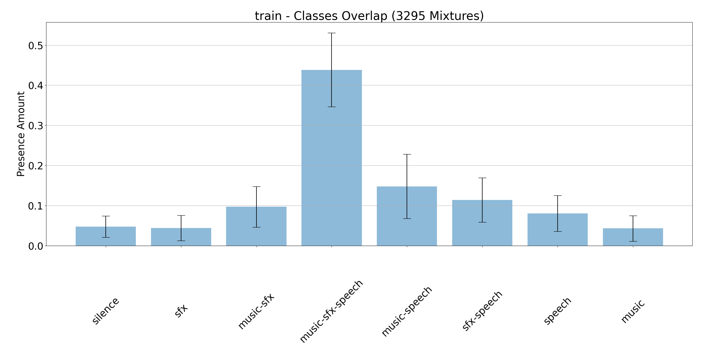

<div style="padding:56.25% 0 0 0;position:relative;"><iframe src="https://www.youtube.com/embed/1BR4SAKDhMk" frameborder="0" allow="autoplay; fullscreen; picture-in-picture" allowfullscreen style="position:absolute;top:0;left:0;width:100%;height:100%;" title="cfp_demo.mp4"></iframe></div><script src="https://player.vimeo.com/api/player.js"></script>
<script type="module" src="https://unpkg.com/dark-mode-toggle"></script>

#### &#9758;  <a href="https://www.youtube.com/watch?v=Tufy3CqdWtc" target="_blank">[Demo Video - Trimmed for UK]</a>

-----
<h3 id="overview">Additional Individual Examples with Isolated Stems</h3>

<style>
table, th, td {
  border: 2px solid white;
  padding-left: 5px;
}
table.left {
  margin-left: auto; 
  margin-right: auto;

}
</style>
<table>
<tr>
    <td></td>
    <td style="text-align:center">Music</td>
    <td style="text-align:center">Speech</td>
    <td style="text-align:center">SFX</td>
</tr>
<tr>
    <td style="text-align:center;font-weight:bold">Jimmy Fallon</td>
    <td style="text-align:center"><a href="https://www.youtube.com/embed/XKPdr_crWxE" style="display:block;">&nbsp;Link</a></td>
    <td style="text-align:center"><a href="https://www.youtube.com/embed/GuxfRkspqxQ" style="display:block;">&nbsp;Link</a></td>
    <td style="text-align:center"><a href="https://www.youtube.com/embed/DHl3kv2SAPI" style="display:block;">&nbsp;Link</a></td>
</tr>
<tr>
    <td style="text-align:center;font-weight:bold">FlexTape Commercial</td>
    <td style="text-align:center"><a href="https://www.youtube.com/embed/tHUOAAopm0s" style="display:block;">&nbsp;Link</a></td>
    <td style="text-align:center"><a href="https://www.youtube.com/embed/cUwccEZu7ok" style="display:block;">&nbsp;Link</a></td>
    <td style="text-align:center"><a href="https://www.youtube.com/embed/yjo7InFIIbY" style="display:block;">&nbsp;Link</a></td>
</tr>
<tr>
    <td style="text-align:center;font-weight:bold">Spiderman</td>
    <td style="text-align:center"><a href="https://www.youtube.com/embed/hLBilWTHWMs" style="display:block;">&nbsp;Link</a></td>
    <td style="text-align:center"><a href="https://www.youtube.com/embed/hLBilWTHWMs" style="display:block;">&nbsp;Link</a></td>
    <td style="text-align:center"><a href="https://www.youtube.com/embed/hLBilWTHWMs" style="display:block;">&nbsp;Link</a></td>
</tr>
<tr>
    <td style="text-align:center;font-weight:bold">Gordon Ramsey (Unavailable in UK)</td>
    <td style="text-align:center"><a href="https://www.youtube.com/embed/MKjqhGd0t6Y" style="display:block;">&nbsp;Link</a></td>
    <td style="text-align:center"><a href="https://www.youtube.com/embed/_uQF5gfGrsk" style="display:block;">&nbsp;Link</a></td>
    <td style="text-align:center"><a href="https://www.youtube.com/embed/J5bGKZFkDso" style="display:block;">&nbsp;Link</a></td>
</tr>
</table>
-----

<h2> <p align="center"> Resources page for the Divide and Remaster (DnR) dataset introduced as part of the Cocktail Fork Problem paper </p></h2>


The DnR dataset is built from three, well-established, audio datasets; [Librispeech](https://ieeexplore.ieee.org/stamp/stamp.jsp?tp=&arnumber=7178964), [Free Music Archive (FMA)](https://arxiv.org/pdf/1612.01840.pdf), and [Freesound Dataset 50k (FSD50K)](https://arxiv.org/pdf/2010.00475.pdf). We offer our dataset in both 16kHz and 44.1kHz sampling-rate along time-stamped annotations for each of the classes (genre for 'music', audio-tags for 'sound-effects', and transcription for 'speech'). We provide below more informations on how the dataset is built and what it's consists of exactly. We also go over the process of building the dataset from scratch for the cases it needs to.

-----

*   [Dataset Overview](#overview)
*   [Get the DnR Dataset](#getdnr)
    *   [Download](#download)
    *   [Building DnR From Scratch](#scratch)
    *   [Known Issues](#issues)
*   [Dataset Analysis](#analysis)
*   [Citation](#citation)
*   [Contact and Support](#contact)

-----

<h2 id="overview">Dataset Overview</h2>
The Divide and Remix (DnR) dataset is a dataset aiming at providing research support for a relatively unexplored case of source separation with mixtures involving music, speech, and sound-effects (SFX) as their sources. The dataset is built from three, well-established, datasets. Consequently if one wants to build DnR from scratch, the aforementioned datasets will have to be downloaded first. Alternatively, DnR is also available on Zenodo

-----

<h2 id="getdnr">Get the DnR Dataset</h2>
In order to obtain DnR, several options are available depending on the task at hand:
<h3 id="download">Download</h3>

- DnR-HQ (44.1kHz) is available on Zenodo at the [following](https://zenodo.org/record/6949108#.Y87Abi-B3yK). **Note:** We recently addressed several issues found from the original dataset (in regards to annotations, mainly). An updated version has now been uploaded to Zenodo. Make sure you use it instead. More info on at the Zenodo link!

- Alternatively, if DnR-16kHz is needed, please first download DnR-HQ locally. You can then downsample the dataset (either in-place or not) by cloning the [dnr-utils](https://github.com/darius522/dnr-utils) repository and running:
```
python dnr_utils.py --task=downsample --inplace=True
```

-----

<h3 id="scratch">Building DnR From Scratch</h3>
In the section, we go over the DnR building process. Since DnR is directly drawn from *FSD50K*, *LibriSpeech*/*LibriVox*, and *FMA*, we first need to download these datasets. Please head to the following links for more details on how to get them:

<h4 id="scratch">Datasets Downloads</h4>

<p align="center">

<a href="https://zenodo.org/record/4060432#.YTkaoN8pBPY">FSD50K</a>
<br>
<a href="https://github.com/mdeff/fma">FMA-Medium Set</a>
<br>
<a href="https://www.openslr.org/12">LibriSpeech/LibriVox</a>

<br><br>
</p>

Please note that for *FMA*, the [medium set](https://os.unil.cloud.switch.ch/fma/fma_medium.zip) only is required. In addition to the audio files, [the metadata](https://os.unil.cloud.switch.ch/fma/fma_metadata.zip) should also be downloaded. For *LibriSpeech* DnR uses [dev-clean](https://www.openslr.org/resources/12/dev-clean.tar.gz), [test-clean](https://www.openslr.org/resources/12/test-clean.tar.gz), and [train-clean-100](https://www.openslr.org/resources/12/train-clean-100.tar.gz). DnR will use the folder structure as well as metadata from LibriSpeech, but ultimately will build the LibriSpeech-HQ dataset off [the original LibriVox mp3s](https://www.openslr.org/resources/12/original-mp3.tar.gz), which is why we need them both for building DnR.

After download, all four datasets are expected to be found in the same root directory. Our root tree may look something like that. As the standardization script will look for specific file name, __please make sure that all directory names conform to the ones described below__:
```
root
├── fma-medium
│   ├── fma_metadata
│   │   ├── genres.csv
│   │   └── tracks.csv
│   ├── 008
│   ├── 008
│   ├── 009
│   └── 010
│   └── ...
├── fsd50k
│   ├── FSD50K.dev_audio
│   ├── FSD50K.eval_audio
│   └── FSD50K.ground_truth
│   │   ├── dev.csv
│   │   ├── eval.csv
│   │   └── vocabulary.csv
├── librispeech
│   ├── dev-clean
│   ├── test-clean
│   └── train-clean-100
└── librivox
    ├── 14
    ├── 16
    └── 17
    └── ...
```
-----

<h4 id="scratch">Datasets Standardization</h4>

Once all four datasets are downloaded, some standardization work needs to be taken care of. The standardization process can be be executed by running [`standardization.py`](https://github.com/darius522/dnr-utils/blob/d895d485bb6d2bde9d7a79faaa7a12172d45b375/standardization.py), which can be found in the [dnr-utils](https://github.com/darius522/dnr-utils) repository. Prior to running the script you may want to install all the necessary dependencies included as part of the `requirement.txt` with `pip install -r requirements.txt`. 
__Note:__ `pydub` uses `ffmpeg` under its hood, a system install of `fmmpeg` is thus required. Please see [pydub's install instructions](https://github.com/jiaaro/pydub#installation) for more information.
The standardization command may look something like:
```
python standardization.py --fsd50k-path=./FSD50K --fma-path=./FMA --librivox-path=./LibriVox --librispeech-path=./LibiSpeech  --dest-dir=./dest --validate-audio=True
```

-----

<h4 id="scratch">DnR Dataset Compilation</h4>

Once the three resulting datasets are standardized, we are ready to finally compile DnR. At this point you should already have cloned the [dnr-utils](https://github.com/darius522/dnr-utils) repository, which contains two key files:

- [`config.py`](https://github.com/darius522/dnr-utils/blob/d895d485bb6d2bde9d7a79faaa7a12172d45b375/config.py) contains some configuration entries needed by the main script builder. You want to set all the appropriate paths pointing to your local datasets and ground truth files in there. 
- The compilation for a given set (here, `train`, `val`, and `eval`) can be executed with [`compile_dataset.py`](https://github.com/darius522/dnr-utils/blob/d895d485bb6d2bde9d7a79faaa7a12172d45b375/compile_dataset.py), for example by running the following commands __for each set__:  
```
python compile_dataset.py with cfg.train
```
```
python compile_dataset.py with cfg.val
```
```
python compile_dataset.py with cfg.eval
```

<h3 id="issues">Known Issues</h3>

Some known bugs and issues that we're aware. if not listed below, feel free to open a new issue [here](https://github.com/darius522/dnr-utils/issues):

* If building from scratch, `pydub ` will fail at reading 15 mp3 files from the FMA medium-set and will return the following error:  `mp3 @ 0x559b8b084880] Failed to read frame size: Could not seek to 1026.`

* If building DnR from scratch, the script may return the following error, coming from `pyloudnorm`: `Audio must be have length greater than the block size`. That's because some audio segment, especially SFX events, may be shorter than 0.2 seconds, which is the minimum sample length (window) required by `pyloudnorm` for normalizing the audio. We just ignore these segments.

-----

<h2 id="analysis">Dataset Analysis</h2>
The file length distributions of the four DnR building blocks are as follows. Note that FMA files occupy a single bin since all files are 30-sec length:

<p align="center">
  
</p>

<br><br>

We also measure the amount of inter-classes overlap, here for the whole DnR training set. Through the building process, we ensure to cover all overlapping scenarios, while emphasizing on the "all-classes" one (accounting for 50% of the data):

<p align="center">
  
</p>

The average length per class files are also provided down below:

<p align="center">
  
</p>

Annotations for each class are provided with time-stamps:

<p align="center">
  
</p>

<hr />

-----

<h2 id="analysis">Experimental Validation</h2>
<style>
table, th, td {
  border: 1px solid white;
  padding-left: 15px;
}
table.left {
  margin-left: auto; 
  margin-right: auto;

}
</style>
<table>
    <tr>
        <td></td>
        <td colspan="3">16 kHz</td>
        <td colspan="3">44.1 kHz</td>
    </tr>
    <tr>
        <td></td>
        <td>Music</td>
        <td>Speech</td>
        <td>SFX</td>
        <td>Music</td>
        <td>Speech</td>
        <td>SFX</td>
    </tr>
    <tr>
        <td style="text-align:left"> </td>
        <td>-6.61</td>
        <td>1.04</td>
        <td>-5.19</td>
        <td>-6.70</td>
        <td>0.94</td>
        <td>-4.94</td>
    </tr>
    <tr>
        <td style="text-align:left"> </td>
        <td>11.99</td>
        <td>18.02</td>
        <td>13.60</td>
        <td>11.99</td>
        <td>18.03</td>
        <td>13.83</td>
    </tr>
    <tr>
        <td style="text-align:left"> </td>
        <td>2.38</td>
        <td>10.98</td>
        <td>3.99</td>
        <td>2.06</td>
        <td>10.72</td>
        <td>4.01</td>
    </tr>
    <tr>
        <td style="text-align:left"> </td>
        <td>2.74</td>
        <td>11.01</td>
        <td>4.02</td>
        <td>2.28</td>
        <td>10.66</td>
        <td>4.22</td>
    </tr>
    <tr>
        <td style="text-align:left"> </td>
        <td>3.73</td>
        <td>12.32</td>
        <td>4.44</td>
        <td>3.45</td>
        <td>12.02</td>
        <td>4.09</td>
    </tr>
    <tr>
        <td style="text-align:left"> </td>
        <td>3.37</td>
        <td>11.77</td>
        <td>4.73</td>
        <td>3.5</td>
        <td>11.79</td>
        <td>5.36</td>
    </tr>
    <tr>
        <td style="text-align:left"> </td>
        <td>3.83</td>
        <td>12.04</td>
        <td>4.92</td>
        <td>3.72</td>
        <td>12.06</td>
        <td>5.33</td>
    </tr>
    <tr>
        <td style="text-align:left"> </td>
        <td>3.51</td>
        <td>11.4</td>
        <td>4.49</td>
        <td>3.52</td>
        <td>11.02</td>
        <td>4.86</td>
    </tr>
    <tr>
        <td style="text-align:left"> </td>
        <td>3.06</td>
        <td>10.34</td>
        <td>3.93</td>
        <td>3.51</td>
        <td>10.95</td>
        <td>4.81</td>
    </tr>
    <tr>
        <td style="text-align:left"> </td>
        <td>3.84</td>
        <td>11.99</td>
        <td>4.99</td>
        <td>3.87</td>
        <td>12.07</td>
        <td>5.46</td>
    </tr>
    <tr>
        <td style="text-align:left"> </td>
        <td>3.76</td>
        <td> <b>12.78</b></td>
        <td>4.32</td>
        <td>3.66</td>
        <td>12.58</td>
        <td>5.05</td>
    </tr>
    <tr>
        <td style="text-align:left"> </td>
        <td> <b>4.39 </b></td>
        <td>12.56</td>
        <td> <b> 5.4</b></td>
        <td>  <b>4.42</b></td>
        <td> <b>12.65</b></td>
        <td>  <b>5.87</b></td>
    </tr>
</table>

-----

<h2 id="citation">Citation</h2>

If you use DnR please cite [our paper](https://arxiv.org/abs/2110.09958) in which we introduce the dataset as part of the *Cocktail Fork Problem*:

```
@InProceedings{Petermann2022CFP,
  author = {Petermann, Darius and Wichern, Gordon and Wang, Zhong-Qiu and {Le Roux}, Jonathan},
  title = {The Cocktail Fork Problem: Three-Stem Audio Separation for Real-World Soundtracks},
  booktitle = {2022 IEEE International Conference on Acoustics, Speech and Signal Processing (ICASSP)},
  year = 2022,
  month = may
}
```

-----

<h2 id="contact">Contact and Support</h2>

Have an issue, concern, or question about DnR or its utility tools ? If so, please open an issue [here](https://github.com/darius522/dnr-utils/issues)

For any other inquiries, feel free to shoot an email at: __firstname.lastname@gmail.com__, my name is Darius Petermann ;)

-----
